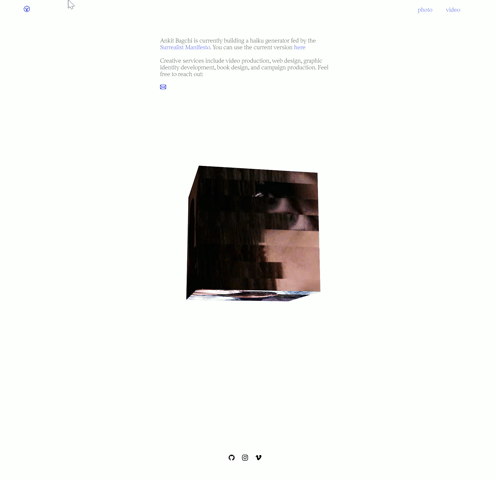

# Responsive portfolio

## Overview

Using the Tachyons Framework, I've populated my portfolio with my recent work from class and my photo and video work.

A separate stylesheet called `home.css` was created to style the cube on my homepage and other elements beyond default Tachyons styles.

#### view the live site [here](https://ya1sec.github.io/portfolio)
